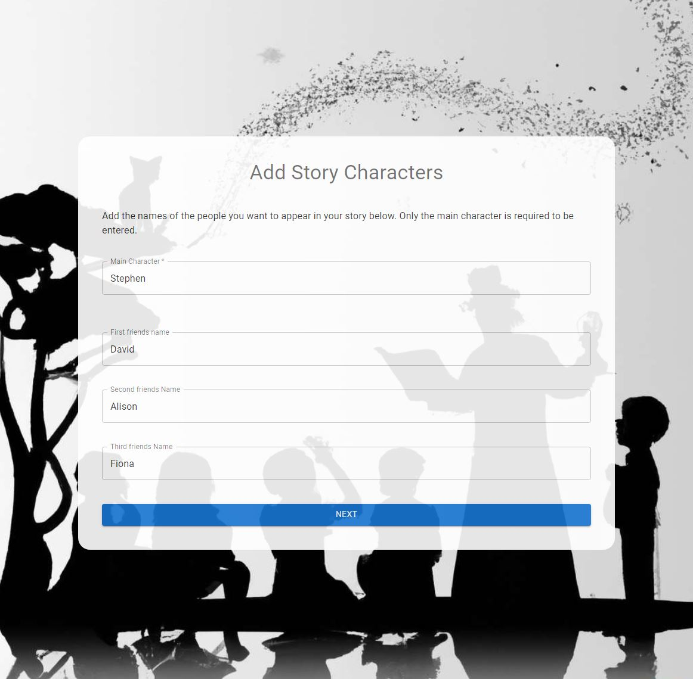

# Story Generator

This app uses generative AI to create a personalised child's story.

## Description

This is a personal project I used to learn how to use ChatGPT via the OpenAI API, as well as implementing a React front end with Routing and Material UI.

Ther server is built using Express.jS server to call out to the ChatGPT completions API to generate a story based on the users input collated from UI.

# Screenshot

<figure>
    
    <figcaption>Screenshot from the front end application.</figcaption>
</figure>

# Installing

- Clone the repository.
- install `node` and `npm`.
- create a .env file in the server folder.
- Add the following lines to the .env file

```
OPENAI_API_KEY=<YOUR GENERATED API KEY>
PORT=3000
```

- Save your .env file

## Client install

From the root folder

```
cd client
npm install
```

If you want to the server to host the application you can build it to the server dist folder using this command.

```
npm run build
```

## Server

From the root folder

```
cd server
npm install
```

# Running the app

You have 2 options to run this application where you can run the Express server with the client hosted or run the client separately.

## Run using hosted client

From root folder

```
cd server
npm start
```

Next navigate to http://localhost:3000

Note if you have changed the default port number you need to amend the URL

## Run client separately

From root folder

```
cd client
npm run dev
```

Next navigate to http://localhost:5173/

<br>

# How to Create an OpenAI API Key - I used chatGPT to generate this !

## Prerequisites

Before you begin, make sure you have the following:

- An OpenAI account: If you don't have one already, sign up for an account on the [OpenAI website](https://openai.com/).

## Steps to Create an OpenAI API Key

1. **Log in to Your OpenAI Account:**
   Visit the [OpenAI website](https://openai.com/) and log in using your registered credentials.

2. **Navigate to the API Section:**
   Once logged in, navigate to your account settings or dashboard. Look for the section related to API access or API keys.

3. **Create a Newnew secret Key:**
   In the API section, you should find an option to create a new API key. Click on it to initiate the key creation process.

4. **Name Your API Key (Optional):**
   You might have the option to name your API key for better organization. This step is often optional, but it can help you identify the purpose of each key if you use multiple keys for different projects.

5. **Generate the API Key:**
   After specifying the optional settings, generate the API key. The platform should provide you with a unique key that you'll use to authenticate API requests.

6. **Safeguard Your API Key:**
   Your API key is sensitive information that should be treated as a password. Do not share it in public repositories, code samples, or with unauthorized individuals. Use environment variables or secure methods to store and manage your API keys.
